# Red Hat Single Sign-On Administration

Red Hat Single Sign-On is a solution derived from the upstream project **Keycloak**
whose purpose is to provide a single sign-on interface for web applications and
RESTful web services.  
The goal is to remove the developer's burden of handling authentication in their
application by relying on an external customizable solution.

RH-SSO provides support for **SAML**, **OpenID Connect**, **oAuth2** identity
providers, social logins (Facebook, GitHub, Google, etc), **two-factor**
authentication, user federation to sync with external ActiveDirectory, LDAP and Kerberos.

RH-SSO is and **identity provider (IDP)** to clients that authenticate to a
**Realm**. A Realm can be defined as a collection of users, roles, groups and
credentials.  
**Federation** with extrenal identity providers (ie Facebook) is possible.
Another very common scenario is the federation with LDAP or AD services for
user credentials storage. RH-SSO can point to these services to validate
provided credentials.

### First login
When executed for the first time an administrative user in the **Master** Realm
must be created. To do this, point to URL http://localhost:8080/auth from the
node running the SSO instance. This redirection is available **only** when
pointing to localhost.

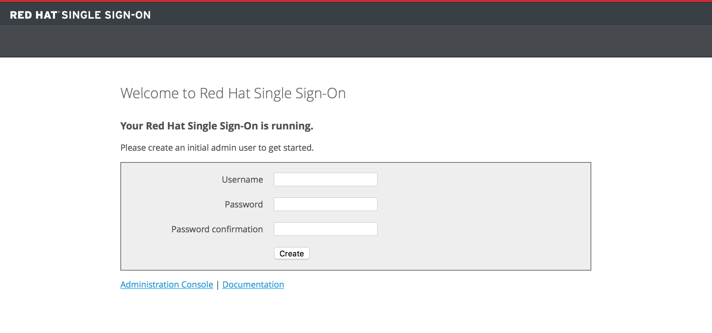

If the localhost URL is not available the `.../bin/add-user-Keycloak.sh` script
in the local installation path can be used to achieve the same result.

When running in standalone mode the script must be executed passing the **realm**
name, username and password:

```
$ .../bin/add-user-Keycloak.sh -r master -u <username> -p <password>
```

The realm name must be **master**.

When running in domain mode one of the server instances must be pointed using the
`--sc` flag:

```
$ .../bin/add-user-Keycloak.sh --sc domain/servers/srv-one/configuration \
  -r master -u <username> -p <password>
```

The newly created user can be tested for the first login at the address
http://hostname:8080/auth. If the connection is done to http://localhost:8080/auth
this time no redirection will happen and the main login page will appear:

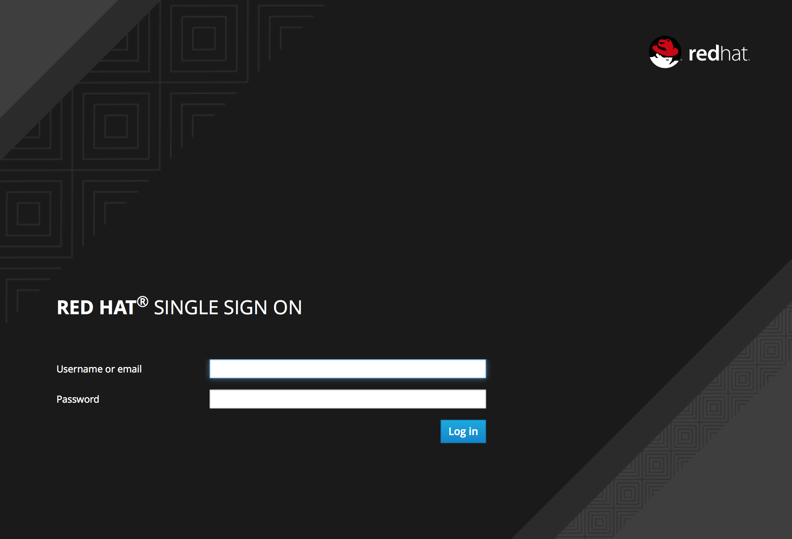

After authenticating with the new credentials the main console page will be
displayed.

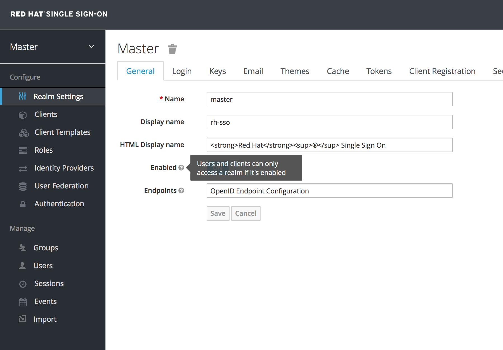

### Realm Management
The **Master** realm settings are displayed, pointing to the **General** tab.
The Master realm is the parent of all realms and is the defaut pre-defined realm.
Admins in this realm can view and manage all other realms created in SSO.

> **_NOTE_**: It is recommended to not use the Master realm in production and
> to reserve it only for superusers to manage the other realms.

For every realm the following tabs are displayed:

- **General**, to configure general settings like the realm name and display name.
- **Login**, to configure login behaviors like email verification of SSL/TLS mode.
- **Keys**, to manage keypairs in the realm.
- **Email**, to configure mail server settings.
- **Themes**, to configure custom themes.
- **Cache**, to manage Realm, User and Keys cache eviction.
- **Tokens**, to manage token lifecycle and SSO sessions.
- **Client Registration**, to manage initial access tokens and client registration
  policies.
- **Security Defenses**, to manage header security options and brute-force
  detection and countermeasures.

#### Realm Creation
To add a new realm click on the drop down menu on the left side: this will show
all the created realms and the button `Add Realm`.  

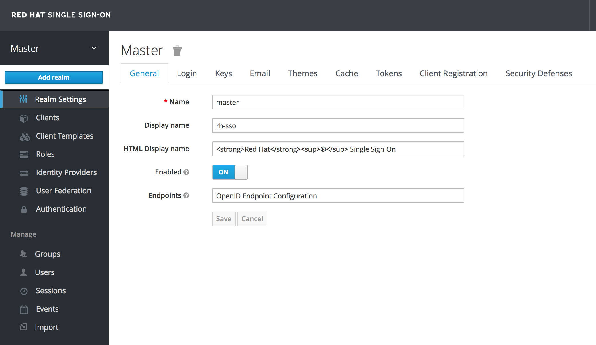

By clicking on it the **Add Realm** page is displayed . A new realm can be created
by importing a JSON file of simply by filling the `Name` field and clicking `Create`.

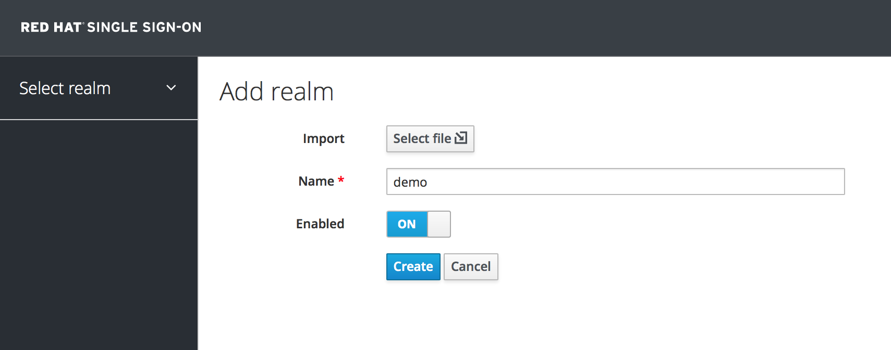

This action will create a new empty realm ready for customizations.

#### Realm Keys
When a new Realm is created a new keypair and a self-signed certificate are
issued for the realm. They will be used to create new signatures: all tokens and
cookies are signed with the keypair.   

Along with the active keypair RH-SSO can hold a set of rotated passive keypairs to verify previous signatures. This lets the administrators to rotate the keypairs with no downtime.  

Keypairs can be seen in the **Keys** tab.

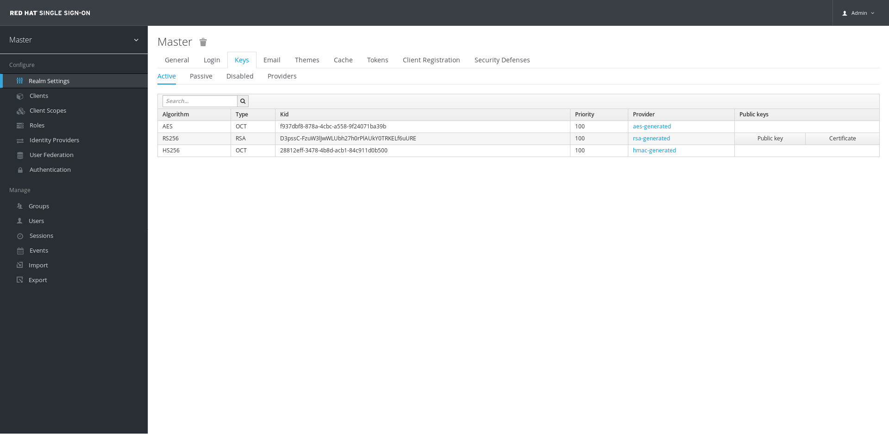

The **Active** and **Passive** sub-tabs show the current active key and the
passivated keys. It's recummended to regurarly rotate the keys.

##### Adding keypairs
To add a new keypair click on the **Providers** sub-tab and then select from
the **Add keystore...** menu the correct provider. Select **rsa-generated** to
create a new RSA keypair. Configure the key priority to the desired value.
Active keypair can coexist in a Realm and the keypair with the highest priority
will be used.


Existing keypairs can be passivated or disabled by configuring their provider.

##### Uploading keypairs
Keypairs and certificates can also be uploaded manually by selecting the **rsa**
provider and choosing the private key and X509 certificate to upload:

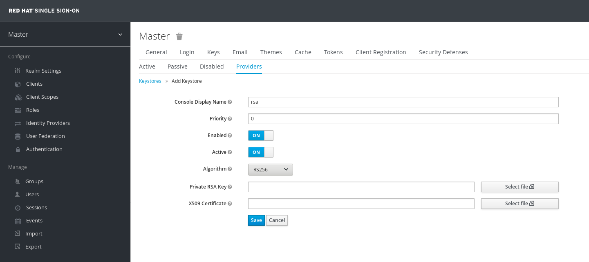

##### Loading keys from Java keystores
Keypairs and certificates stored in a Java Keystore can be uploaded using the
**Keystore** provider and by passing the keys file, along with the Keystore
password, key alias and password.

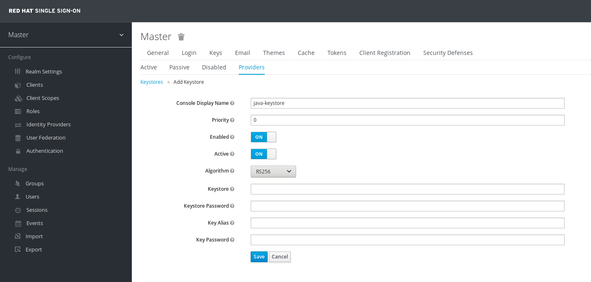

#### Ream Themes
After creating a Realm themes can be customized.
A theme consists of:

- HTML templates
- Images
- Message bundles
- Stylesheets
- Scripts
- Theme properties

Themes are installed in the `themes` directory in the RH-SSO installation path.
By default three themes are installed, **base**, **keycloak** and **rh-sso**.
These defaault themes shouldn't be modified. Instead, new themes should be
added to extend the build-int themes.

The themes section in the Realm Settings offer four different theme customization
choices:

- Login Theme
- Account Theme
- Admin Console Theme
- Email Theme

The **Internationalization** switch enables users to choose their language in
every theme.

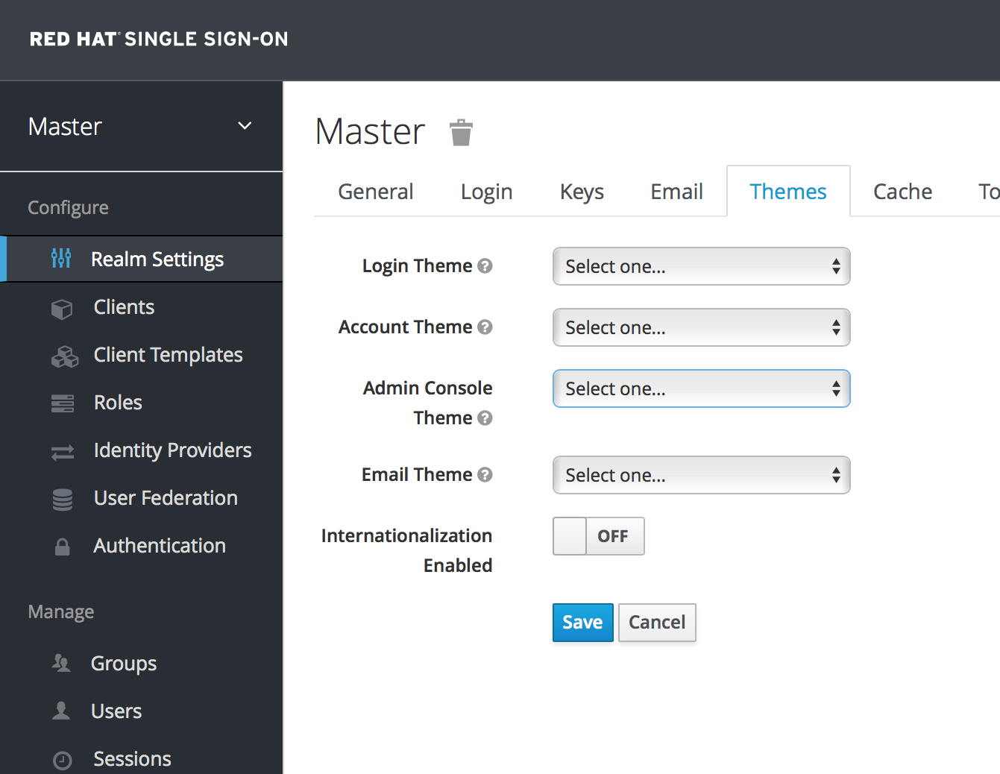

### User Management
Users can be managed by clicking in the left menu `Users` item.
By clicking on the `Add User` button a new user can be created. The only
mandatory field is the **username**. Users cna be created **Enabled** by
default or **Disabled**. Administrators can force the users to verify their
email address or not with the `Email verified` boolean.
The `Requires User Actions` fields is a set of actions done when the user logs
in:

- **Verify email** sends an email to the user to verify his/her address.

- **Update profile** forces user to update his/her profile upon first login.

- **Update password** forces user to update the password.

- **Configure OTP** forces OTP configuration after first login.

Default required actions can be enabled/dsabled by clicking the **Authentication**
section in the left menu and selecting the **Required Actions** tab.

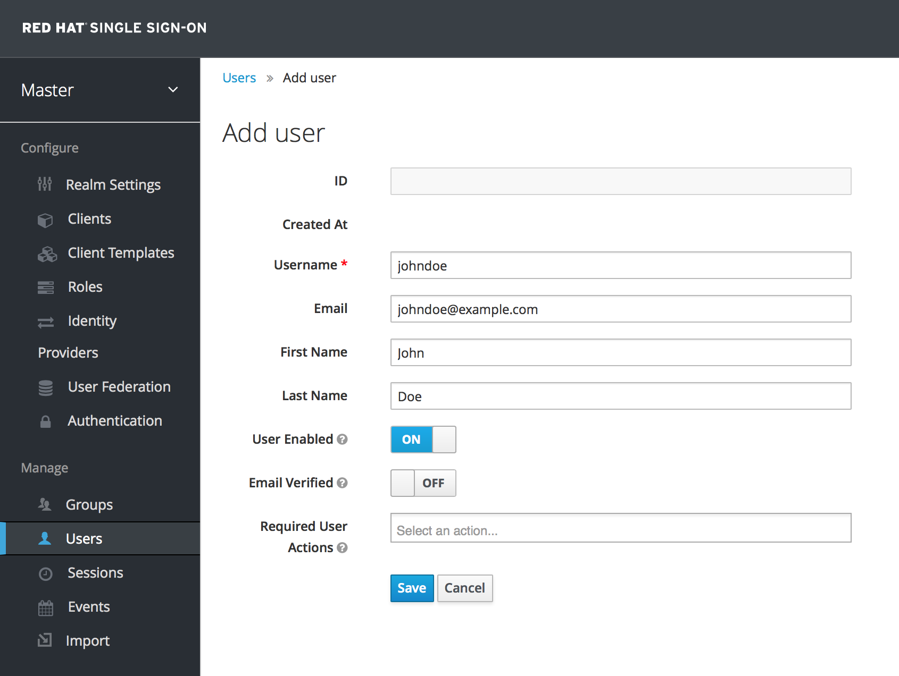

Newly created users will appear in the main Users tab. For every user the Realm
administrator can choose the following actions:

- `Edit` to modify the user settings.

- `Impersonate` to become the user for testing purposes.

- `Delete` to remove the user.

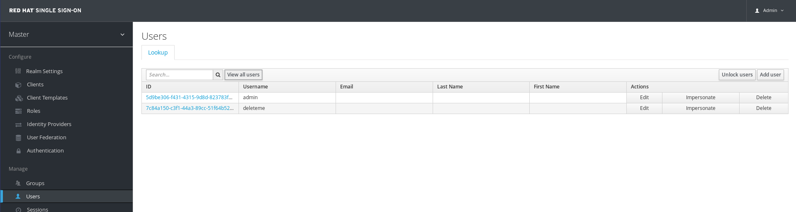

#### User Credentials
Realm admins can set users passwords in the **Credentials** tab in the user
settings. The password can be set as **Temporary** to force the change upon next
user login.

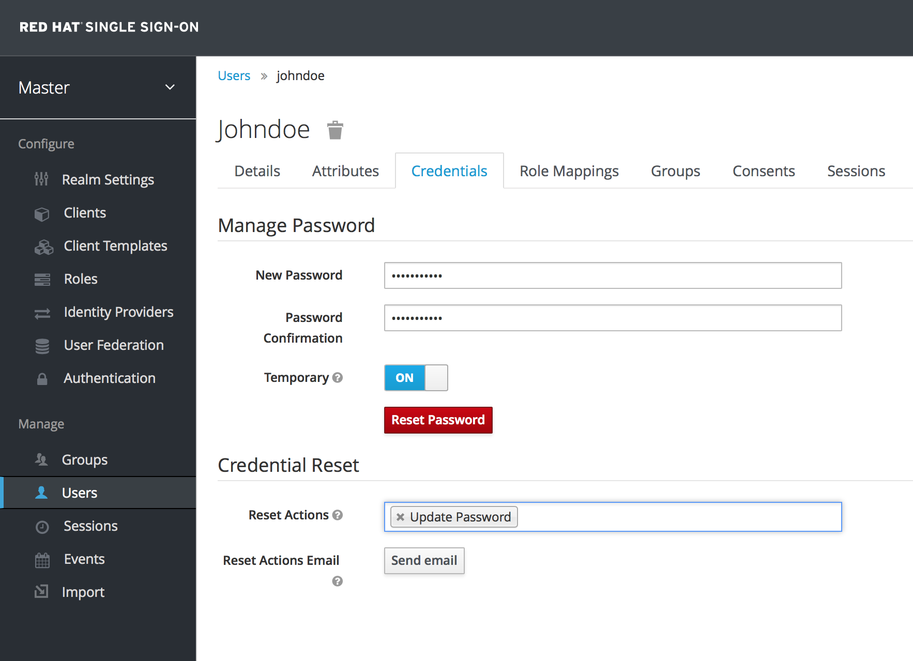

A very important feature is the management of the password policy in RH-SSO.
Administrators can setup the following policies in every Realm:

- **Expire Password**: password expiry date. Default value is 365 days.

- **Hashing Iterations**: number of hashing iterations. Default value is 27500.

- **Special Characters**: number of mandatory special characters. Default value
  is 1.

- **Not Recently Used**: number of recently used passwords to reject. Default
  value is 3.

- **Uppercase Characters**: number of mandatory uppercase characters. Default
  value is 1.

- **Lowercase Character**: number of mandatory lowercase characters. Default
  value is 1.

- **Password Blacklist**: the name of the password blacklist file, expected
  under `${jboss.server.data.dir}/password-blacklists`. Default is empty.

- **Minimum length**: the password minimum length. Default value is 8 characters.

- **Regular Expression**: a regexp that must be matched by passwords. Default is
  empty.

- **Digits**: the number of mandatory ditigs. Default value is 1.

- **Not Username**: avoid using the username as a password. No defaults.

- **Hashing Algorithm**: the algorithm used for password hashing. Default value
  is **_pbkdf2-sha256_**.

Password policies are configured in **Authentication** -> **Password Policy**.

The following example shows a password policy which force at least 1 digit, 1
uppercase character, 1 lowercase character, 1 special character, no username,
and minimul lenght of 8 characters. Users cannot recycle the last 3 used passwords.

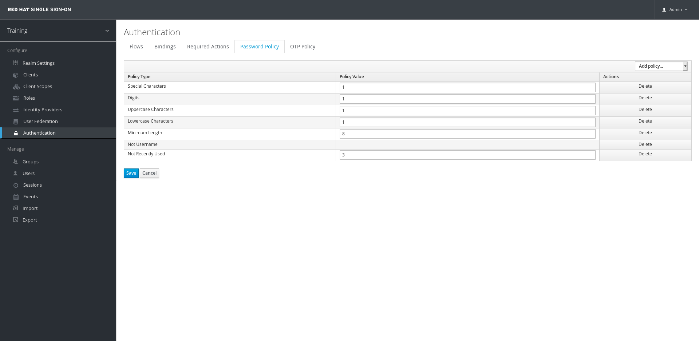

#### User OTP configuration
Administrators can force users to setup two-factor authentication using an
OTP application like [FreeOTP](https://freeotp.github.io/) or Google Authenticator.
Users must install either one of this apps in order to autheticate using 2FA.

In RH-SSO this task involves the intervention of the user to setup for the first
time the OTP app by scanning a provided QR code.
Administrators can force users to complete this task upon first login using the
**Configure OTP** Required Used Action.

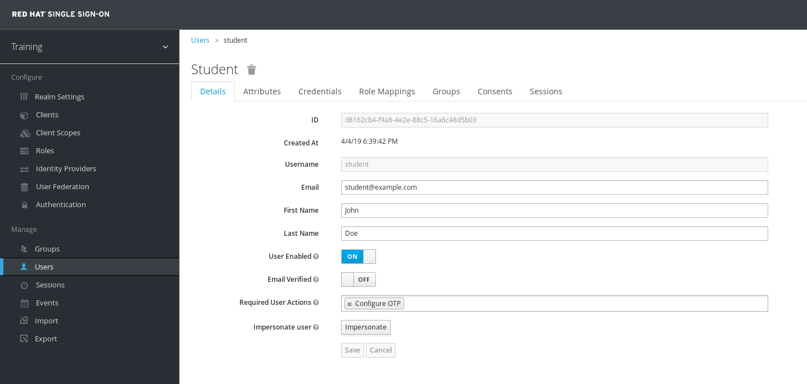

When the user first logs in the Mobile Authenticator Setup screen will appear
asking to scan the QR code with the phone camera and generate a one time code.

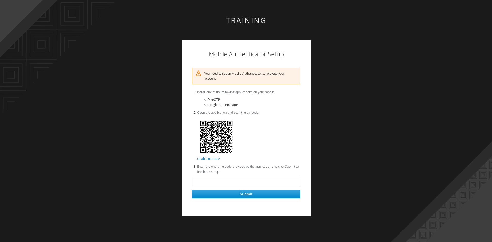

The Realm OTP policy can be configured in **Authentication** -> **OTP Policy**.
Here administrators can setup the OTP Type, Hash Algorithm, the number of
generated digits and the token period.

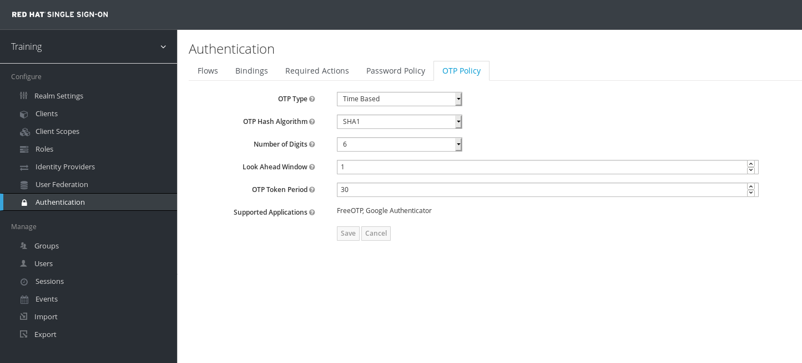

#### User Self-registration
Red Hat Single Sign-On can be configured to allow user self-registration in the
defined Realm. To enable it enable the `User registration` switch in **Realm
Settings** -> **Login**.

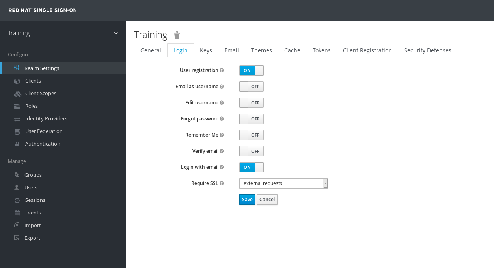

 This action will enable a **Register** link in the login page.

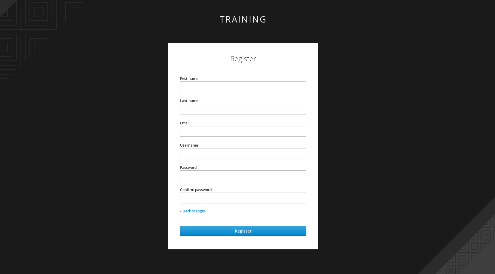

#### Password Recovery
Administrators can let Realm users recover their passwords by enabling the
option `Forgot password` under **Realm Settings** -> **Login**.


The message sent to the user will include a link to reset the credentials.
The text of the email message is totally customizable by editing the email theme.

Administrators can manage the behavior of credentials reset under **Authentication**
-> **Flows** in the `Reset Credentials` dropdown menu item.

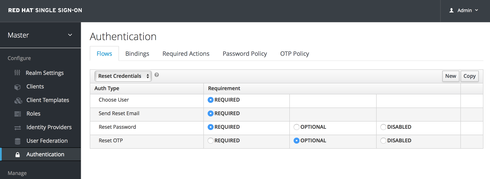

### Groups Management
Users can be member of zero or more group in the Realm and by being member they
inherit the group role mappings.
Groups can be organized in a hierarchical way by creating parent groups and
subgroups as children. If a user belongs to a subgroup, it inherits all the
attributes and role mappings of the parent.
To add a new group select the left menu item `Groups` and click on the `New`
button and choose a unique group name to create the group.


The new group can be configured by setting **Attributes**, **Role Mappings**.
The **Members** tab only shows the current members, which must be configured
per user.


To create a subgroup select the parent gruop in the main **Groups** list and
click the `New` button:

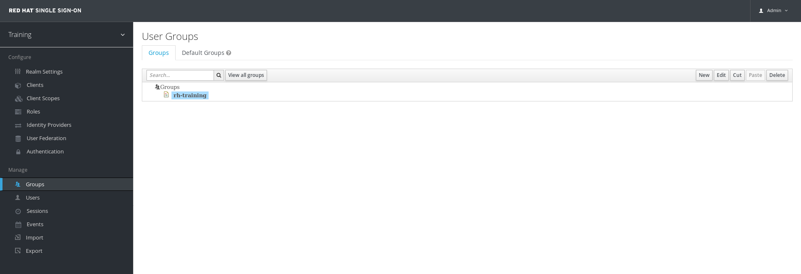

The new subgroup will appear as a child item of the parent:

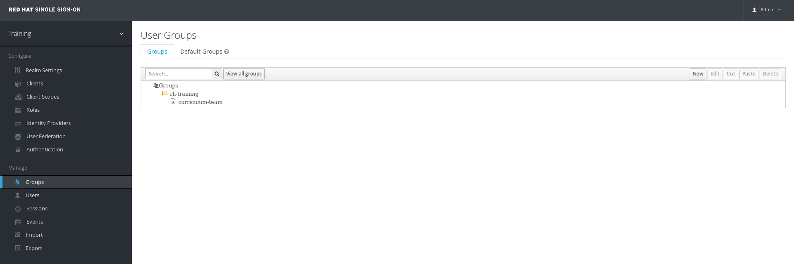

#### Assign Users to Groups
To assign users to a group go `Users` -> *user ID* -> `Grups` and select the
desired group(s) from the **Available Groups** list and click `Join`. The
group will appear in the **Group Membership** list.

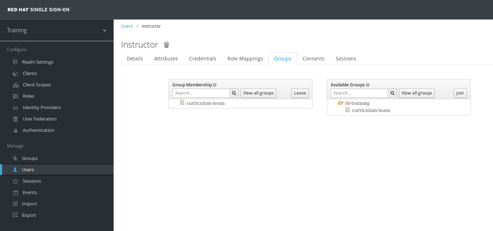

To avoid editing groups on large sets of users administrators can define
**Default Groups** that will be automatically assigned to avery new user created.

To populate the list of default groups go to the  `Default Groups` tab from the
`Groups` menu, select the desired groups from the **Available Groups** list
and click `Add.`

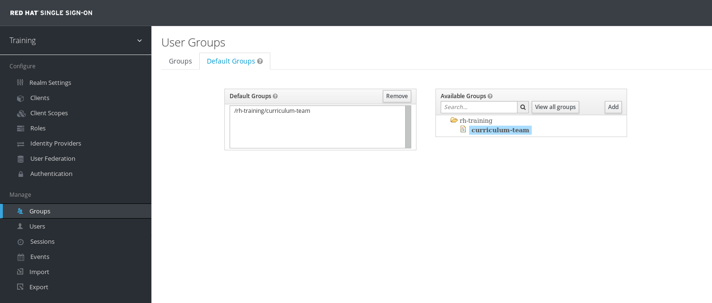 


### Protocols Overview
This section shows how to manage **OIDC** clients and **SAML** clients in Red
Hat Single Sign-On.

#### OpenID Connect
**OpenID Connect** (OIDC) is an authentication protocol that extends the **OAuth2**
protocol. OIDC can be synthetized in two main authentication scenarios:

- An application asks to an OIDC capable provider to authenticate a user for
  it and receives 2 tokens. On success it receives an **identity token** containing informations about the user identity and an **access token** containing access informations and authorizations. The latter is digitally signed by the realm.

- A client asking access to remote services and receives an **access token** it
  can use to invoke the remote services via REST invocations. The access token
  is digitally signed by the realm. When a user tries to access the REST service
  with the access token the service verifies the token signature and gives
  access to the user accordingly with the authorization informations provided
  by the token.

Basically OIDC auth flows can be restricted to 4 different kinds:

1. **Authorization Code Flow**, used by browsers authentications. When a browser
visits an application is redirected to RH-SSO. In the redirection a **callbak URL**
is passed as a query parameter to be used after authentication to redirect the
request. If authentication succeeds RH-SSO redirects to the callbak URL passing
a short lived **code** as a query parameter. This code is valid for very short
time window. The application uses this code to make a REST invocation to RH-SSO and receive the *identity*, *access* and *refresh* tokens. This is the best approach for browser authentication.
Response code is not the only short lived object. Access tokens have a short
lifecycle (few minutes). Applications can use the refresh token to obtain a new
access token after expiration.

2. **Implicit Flow**, a less secure kind of browser authentication. Here there
is no code returned as query parameter during the redirection. RH-SSO directly
creates the identity and access token upon authentication and passes them as
query parameters in the callback URL. The tokens are finally extracted by the
application. This is less secure and not recommended because access tokens can be leaked from the browser history.

3. **Direct Access Grant**, used by REST clients (like CLIs, curl or http
libraries) to get a token on behalf of a user. The client make an HTTP **POST**
request passing user credentials, client id (and client secret for confidential
clients) as form parameters. RH-SSO response container the identity and access
token, along with the refresh token.

4. **Client Credential Grant**, used by REST clients. The token is created upon
the metadata and permissions of a **service account** associated with the client.

All of the above approaches use the `/realms/{realm-name}/protocol/openid-connect/token` endpoint to request the
temporary code (in the case of Authorization Code Flow) or the tokens (in the case
  of Implicit Flow, Direct Access Grant, Client Credential Grant).

#### SAML
The alternative protocol used in RH-SSO is **SAML 2.0**, a more mature choice
based on the SOAP architecture wich uses a XML encodings to transport data
between authentication servers and application, thus generating a lot more traffic.

It can be used to authenticate users in applications, which receive from RH-SSO a **SAML assertion** - a digitally signed XML document containing user informations
and mappings - or by clients who need to authenticate to remote services.

They way SAML assertions are exchanged is defined by **SAML Bindings**. There are
three kind of bindings covered here:

- **Redirect Binding**, which uses a series of redirects from the applications to
  the SSO server and back to the application passing XML payloads as query
  parameters and digitally signing them. It uses HTTP GET methods to pass data.
  This binding is used in web browser sessions.

- **POST Bindings**, similar to the Redirect Bindings but uses HTTP POST methods
  to pass payloads. This is also used in web browser sessions and leverages on
  JavaScript code to manage the POST requests.

- **ECP Binding**, used in non-browser sessions by REST or SOAP clients.

All of the above bindings use the endpoint `/realms/{realm-name}/protocol/saml`.

### Clients
In Red Hat Single Sign-On clients are applications which request authentication
for a users. They can be simple applications requesting SSO to provide an
authentication backend or clients which need tokens to authenticate on external
services. The configuration of clients is a critical part of RH-SSO administration.
Anyway, defining new client in the administration console is easy and
straight-forward.

The client section is accessible from the left menu and displays a list of all
configured clients:

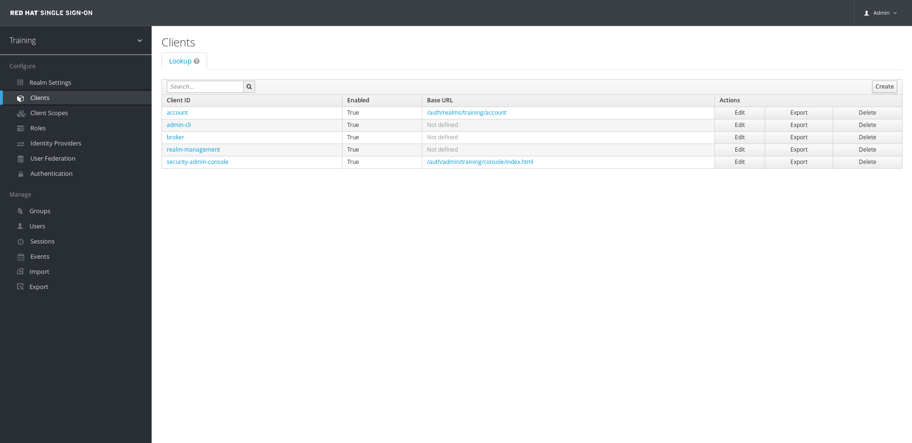

#### Manual configuration of an OIDC client
To define a new client click on the `Create` button:


The **Add Client** page can be used to import a JSON configuration or to define
a new new client passing the **Client ID** (mandatory), **Protocol** (OIDC or
SAML) and, optionally, the **Root URL**, to be appended to relative URLs.

For example, to create a client called **demo-app**, using OIDC with Root URL
**http://localhost:8080/demo**:

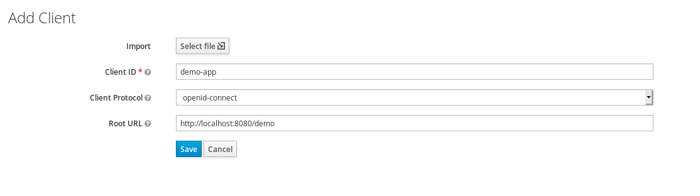

After creation of the client the summary page will show configuration details,
offering many other custom choices about the client behavior. A refined
customization of the client is often required.

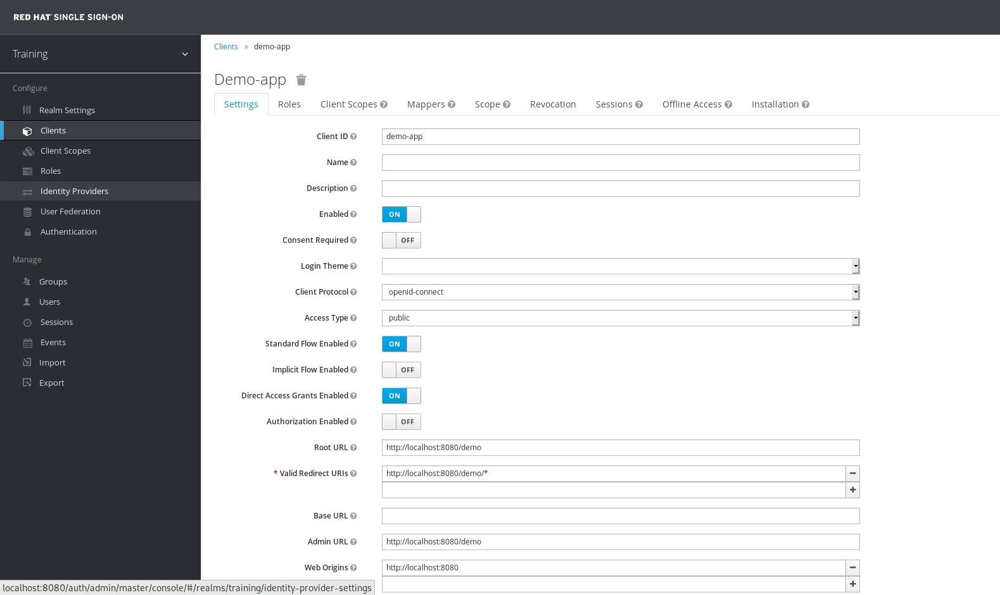

The following list highlights some of the most common fields:

- **Client ID**, the name provided in the first creation window.

- **Name**, the display name of the client in RH-SSO UI screen.

- **Enabled**, to toggle the client on or off.

- **Consent Required**, to ask the user to grant access to the application.

- **Access Type**, which has 3 possible options:

  - **_Confidential_**: Used by clients capable of maintaining the confidentiality
    of their credentials and based on a client secret to initiate the login
    protocol. When this access type is choosen a new **Credentials** tab is
    enabled.

  - **_Public_**: Used by client which don't require a secret and are not capable
    of secure authentication.

  - **_Bearer-Only_**: The application allow bearer token requests only. Useful
    for CLI tools that require a bearer token to pass to users to esecute API
    calls or web services that never initiate a browser login.

- **Root URL**: The URL to prepend to relative endpoints.

- **Valid Redirect URIs**: A list of accepted redirection. By default, when a
  Root URL is defined during client creation, this is configured with a
  wildcard value.   
  For example, if the Root URL is http://localhost:8080/demo, the
  default redirection will be http://localhost:8080/demo/* and every pattern
  will be accepted. This configuration has potential security issues thus
  enabling puntual redirections is a better choice.

- **Admin URL**: Used by RH-SSO only on client specific adapters as a callback
  URL for administrative tasks.

- **Web Origins**: Enables support for **CORS** (Cross Origin Resource Sharing)
  request for the domains defined in the list.

#### Importing from JSON
To import a client from a JSON config click `Select File` and choose the file to
be imported. The following example show a minimal client configuration took from
the **keycloak-quickstarts**:

```
{
    "clientId": "app-authz-vanilla",
    "rootUrl": "http://localhost:8080/app-authz-vanilla",
    "enabled": true,
    "redirectUris": [
        "http://localhost:8080/app-authz-vanilla/*"
    ],
    "webOrigins": [
        "http://localhost:8080"
    ],
    "publicClient": false,
    "secret": "secret",
    "serviceAccountsEnabled": true,
    "authorizationServicesEnabl`d": true
}`
```

Before importing any customization can be applied to the file. Otherwise,
the client can be updated later in the Summary page.
After import, additional configuration tasks can be applied. Like the secret
regeneation in the **Credentials** tab.

#### Credentials tab
The Credentials tab is enabled when **confidential** access type is choosen.
Administrators can configure 4 types of client authentication mechanisms:

- **Client Id and Secret**: the default behavior. Secure clients pass their id
  and the secret, calculated from the server and provided to clients upon
  registration. This secret is used as a symmetric key to encrypt exchanges
  between client and server. The secret is never transferred and uses HMAC
  algorithm for key exchange encryption but there is no signature verification.
  The secret is dynamically generated by the server and can be regenerated.

- **Signed JWT**: When a more robust approach is needed and symmetric key
  encryption is not an option the Signet JWT autheticator can be choosen. This
  approach is more CPU intensive. It is based on **JSON Web Tokens** and the RSA algorithm to sign the tokens. For this reason a private key and a certificate
  must be generated. The private is used to sign the JWT and the certificate to
  verify the signature. The private key will be stored in a JKS file offered for
  download and the certificate will be stored in RH-SSO database.
  External tools can be used and certificate import is possible.

- **Signed JWT and Secret**: The JWT is signed with a symmetric secret instead
  of the private key.

- **X509 Certificate**: The client must use an X509 certificate during TLS
  handshake. The subject DN can be checked using regular expressions. To accept
  all certificates, use the regexp `(.*?)(?:$)` to match every DN.

### Manual configuration of a SAML client
To add as SAML client use the same approach as in the OIDC client and select
**saml** in the **Client Protocol** field.
The **Client SAML Endpoint** will be the URL where RH-SSO will exchange requests
and responses with the application.

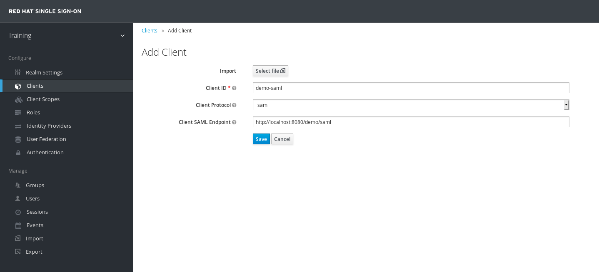

The configuration page of a SAML client has different paramentes, compared to
the OIDC client.

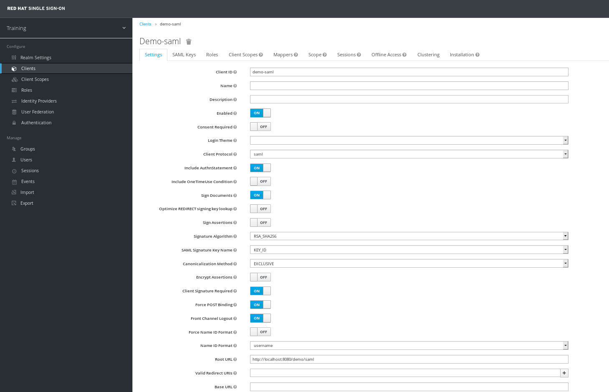

Some fields deserve a better explaination:

- **Client ID**: this is the ID that must match the value sent by the issuer
  with the SAML Authn request.

- **Include AuthnStatement**: enables the inclusion of Authn statements to
  display the authentication method and timestamp in the response document.

- **Sign Documents**: to sign the documents with the realm's private key.

- **Optimize REDIRECT signing key lookup**: enable the inclusion in SAML protocol
  messages of RH-SSO native extension that contains a hint with signing key ID.

- **Sign Assertions**: Sign the assertion and embed it with SAML XML Auth response.

- **Signature Algorithm**: the algorithm used for the signature.

- **SAML Signature Key Name**: the content of the **KeyName** field in the
  SAML documents sent by POST bindings. Three options between **Key_ID**,
  **CERT_SUBJECT** and **NONE**.

- **Encrypt Assertions**: enables the encryption of assertions in SAML documents
  using the realm's private key and AES algorithm.

- **CLient Signature Required**: with this option enabled the clients must sign
  their SAML requests.

- **Force POST Binding**: force the POST binding even if the origin request was
  was a Redirect binding. By default the response is on the same kind of binding
  as the request.

- **Front Channel Logout**: when enabled require a browser redirect to logout.

- **Force Name ID Format**: Force the NameID format defined in the admin console.

- **Name ID Format**: The name ID format to be used for the subject. Options are:
  - **_username_**
  - **_email_**
  - **_transient_**
  - **_persistent_**

- **Root URL**: the root URL prepended to relative URLs.

- **Valid Redirect URIs**: a list of valid URL a browser can redirect to after
  successful login. It accepts relative paths and simple wildcards at the end of
  the URL (like `http://localhost:8080/demo/*`)

- **Base URL**: default URL used when the auth server needs to redirect or link
  back to the client.

- **Master SAML Processing URL**: used for binding to both the SP's **Assertion
  Consumer** and **Single Logout Services**. Fine grained settings can be
  passed in the **Fine Grain SAML Endpoint Configuration** section.

### Client Adapters Configuration
Once defined in Red Hat Single Sign-On client adapter must be configured in the
**Installation** section.

Native client adapters can be downloaded and installed in the own application server and
are available for both OIDC and SAML. Client adapter can ben generic **Java
Client Adapters** or platform specific. For example, JBoss EAP client adapters
are available in both zip, tar.gz o rpm format.
Once installed the adapters can be configured to handle specific applicatinos
using the configuration generated in the **Installation** section of the OIDC or SAML client. Generated configuration can be in JSON format or XML format for
platform specific adapters.

#### Example: Configuring the JBoss EAP adapter
The following example shows how to install and configure the JBoss EAP client
adapter from a zip file.

##### Download and install
Download the client adapter and place it in the JBoss EAP home directory (the root
installation path of EAP).

```
cd $EAP_HOME
unzip rh-sso-7.3.0.GA-eap7-adapter.zip
```

The archive will place jar files, docs and scripts (CLI batch files) in the **bin**,
**docs** and **modules** directory.

Once extracted the adapter must be configured to setup the related **extension**,
and the **Elytron** SecurityRealm related to SSO.

If no EAP instance is running execute the following command:

```
$ $EAP_HOME/bin/jboss-cli.sh --file=bin/adapter-elytron-install-offline.cli
```

The above script works with EAP 7.1 and newer.
If the EAP version is 7.0 Elytron is not installed and the old Security subsystem
must be configured with this alternate CLI batch:

```
$ $EAP_HOME/bin/jboss-cli.sh --file=bin/adapter-install-offline.cl
```

If there are running instances launch the online versions.

For **EAP 7.1 and newer**:
```
$ $EAP_HOME/bin/jboss-cli.sh --file=bin/adapter-elytron-install.cli
```

And for **EAP 7.0**:
```
$ $EAP_HOME/bin/jboss-cli.sh --file=bin/adapter-install.cli
```

##### Application Configuration
Besiedes the SecurityRealm configuration the most important change provided by
the above command is the installation of a new extension based on the module
`org.keycloak.keycloak-adapter-subsystem` and the related subsystem.

To configure a client in this subsystem download the installation code from
the **Client** config page in RH-SSO. For example, if a OIDC client is configured
select **Keycloak OICD JBoss Subsystem XML** format:

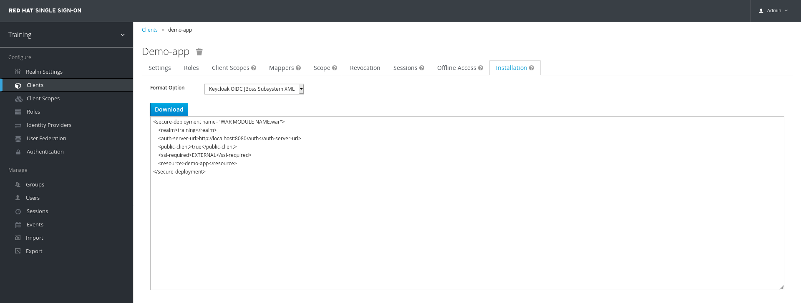

Download the XML file or copy the generated text.
The copied text must be inserted in the **Keycloak** subsystem configuration in
the EAP XML files (standalone or domain):

```
<profile>
  <subsystem xmlns="urn:jboss:domain:keycloak:1.1">
     <secure-deployment name="WAR MODULE NAME.war">
        <realm>training</realm>
        <auth-server-url>http://localhost:8080/auth</auth-server-url>
        <public-client>true</public-client>
        <ssl-required>EXTERNAL</ssl-required>
        <resource>demo-app</resource>
     </secure-deployment>
  </subsystem>
</profile>
```

**IMPORTANT:** Note the **WAR MODULE NAME.war** name in the `secure-deployment`
field. The generic name must be update with the real application name. For example,
if the deployed application we need to secure is called `HelloWorld.war` this
name will replace the above mentioned default value.

Multiple deployments can also the same Realm in the configuration:
```
<subsystem xmlns="urn:jboss:domain:keycloak:1.1">
    <realm name="demo">
        <auth-server-url>http://localhost:8080/auth</auth-server-url>
        <ssl-required>external</ssl-required>
    </realm>
    <secure-deployment name="customer-portal.war">
        <realm>demo</realm>
        <resource>customer-portal</resource>
        <credential name="secret">password</credential>
    </secure-deployment>
    <secure-deployment name="product-portal.war">
        <realm>demo</realm>
        <resource>product-portal</resource>
        <credential name="secret">password</credential>
    </secure-deployment>
    <secure-deployment name="database.war">
        <realm>demo</realm>
        <resource>database-service</resource>
        <bearer-only>true</bearer-only>
    </secure-deployment>
</subsystem>
```

##### Code Annotations:
From the application point of view, an EJB that must use the Keycloak
Security Domain must embed the `@SecurityDomain("keycloak")` annotation:

```
import org.jboss.ejb3.annotation.SecurityDomain;
...

@Stateless
@SecurityDomain("keycloak")
public class CustomerService {

    @RolesAllowed("user")
    public List<String> getCustomers() {
        return db.getCustomers();
    }
}
```

##### Web deployment auth method
Once updated from the code point of view, the deployment descriptor named `web.xml`
must updated with tne new auth method by setting up the **security-constraint**
section. The following is an example of a secured `web.xml`:

```
<web-app xmlns="http://java.sun.com/xml/ns/javaee"
      xmlns:xsi="http://www.w3.org/2001/XMLSchema-instance"
      xsi:schemaLocation="http://java.sun.com/xml/ns/javaee http://java.sun.com/xml/ns/javaee/web-app_3_0.xsd"
      version="3.0">

    <module-name>application</module-name>

    <security-constraint>
        <web-resource-collection>
            <web-resource-name>Admins</web-resource-name>
            <url-pattern>/admin/*</url-pattern>
        </web-resource-collection>
        <auth-constraint>
            <role-name>admin</role-name>
        </auth-constraint>
        <user-data-constraint>
            <transport-guarantee>CONFIDENTIAL</transport-guarantee>
        </user-data-constraint>
    </security-constraint>
    <security-constraint>
        <web-resource-collection>
            <web-resource-name>Customers</web-resource-name>
            <url-pattern>/customers/*</url-pattern>
        </web-resource-collection>
        <auth-constraint>
            <role-name>user</role-name>
        </auth-constraint>
        <user-data-constraint>
            <transport-guarantee>CONFIDENTIAL</transport-guarantee>
        </user-data-constraint>
    </security-constraint>

    <login-config>
        <auth-method>KEYCLOAK</auth-method>
        <realm-name>this is ignored currently</realm-name>
    </login-config>

    <security-role>
        <role-name>admin</role-name>
    </security-role>
    <security-role>
        <role-name>user</role-name>
    </security-role>
</web-app>
```

### Client Scopes
Clients inherit the configured Realm **Client Scopes**. Every time a new Realm is
created, some builtin client scopes are generated. Administrators can manage them
by selecting the `Client Scopes` left menu item.

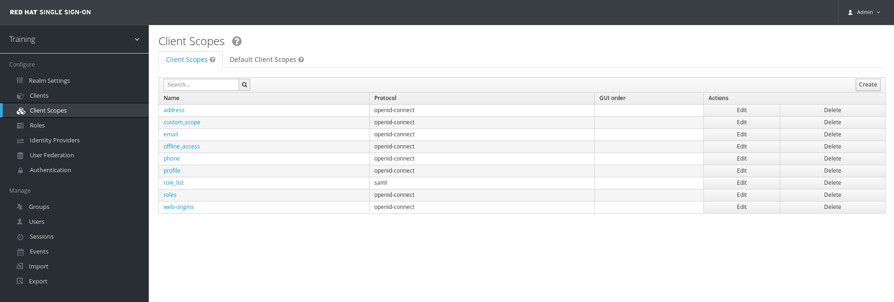

Default client scopes are generated for OIDC and SAML compliancy, most of them
being related to OIDC protocol. When a new client scope is created it can be
added to Default client scopes in the `Default Client Scopes` tab.

When setting up a new client the related protocol scopes are automatically
inherited and can be seen in the client tab `Client Scopes`.

The following example shows a SAML client inherited scopes:

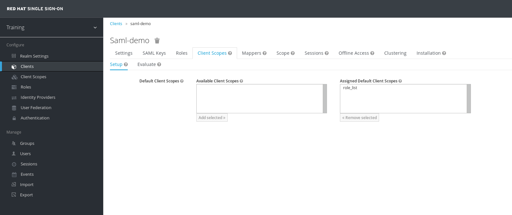

**IMPORTANT**:
**What Client Scopes do?** Their purpose is to hold **Protocol Mappers** and
**Role Scope Mappings**.

#### Protocol Mappers
When an application receives a Token or a SAML assertion it may want to receive
some specific user metadata and roles. For example, thins like **phone**, **email**,
**verified email** can be mapped into the token or assertion.

Mappers can be configure per-client for a fine grained customization or
in custom Client Scopes to be linked to the client. When a client links to
a client scope its protocol mappers are inherited. All client inherit the builtin
client scopes defined for the specific protocl (OIDC/SAML).

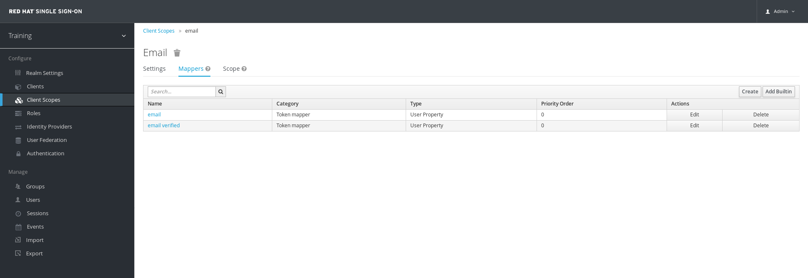

#### Scope Mappings
Scope mappings define which roles mappings are included in the access token
requested by the client. Both Realm defined Roles and Client defined Roles can
be mapped in che Scope Mappings. This is a very useful feature to automtically
embed specific roles in clients inheriting a client scope.

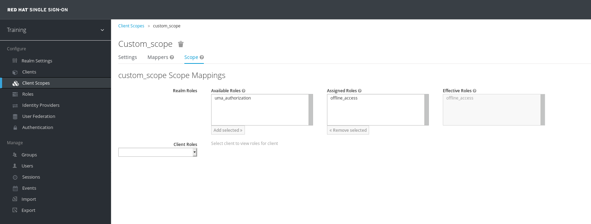

#### Client Scopes Evaluation
Client can also evaluate the linked client scopes in the `Evaluate` tab to test
the effective Protocol Mappers and Role Scope Mappings.

OIDC clients can also verify the content of the generated token for a given user.
The following example shows the client scope evaluation for a *student* user:

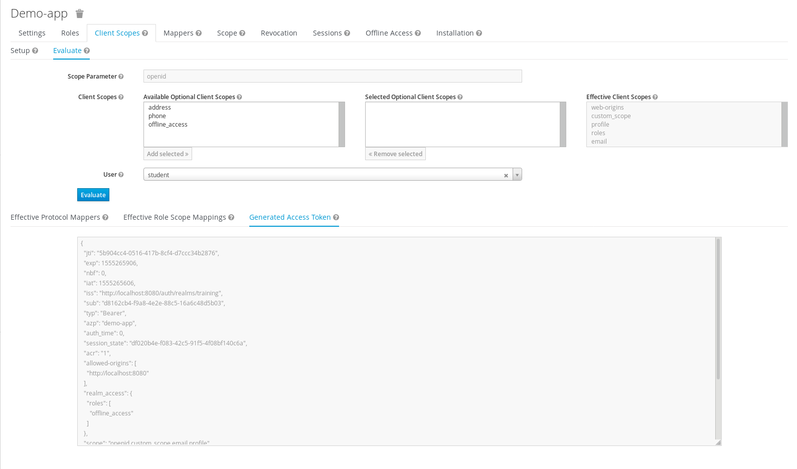

### Roles management
Roles define specific behaviors and limits. They should not be confused with
**Groups**, which are collections of **Users**. Roles are basically organized in two main categories:

- **Realm Roles**, a Realm scoped namespace of Roles.
- **Client Roles**, a client scoped namespace of Roles.

Roles can be simple or **composite**, including other defined Roles.

#### Adding Realm Roles
To add ad Realm Role click on the `Roles` left menu item and then on the `Add Role`
button.

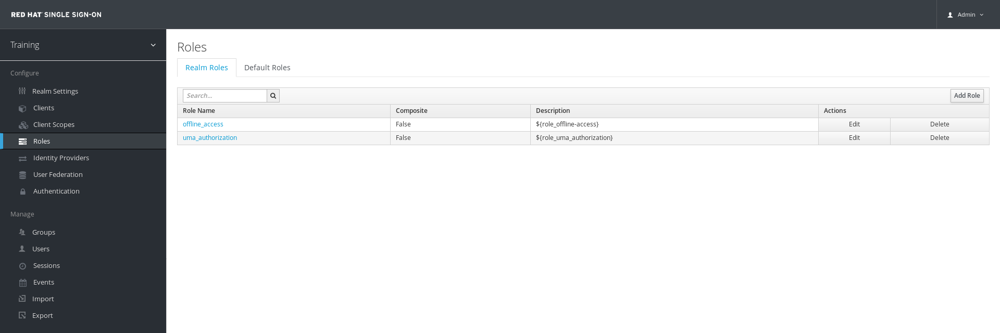

The **Role Name** field is mandatory in the Role Add panel:

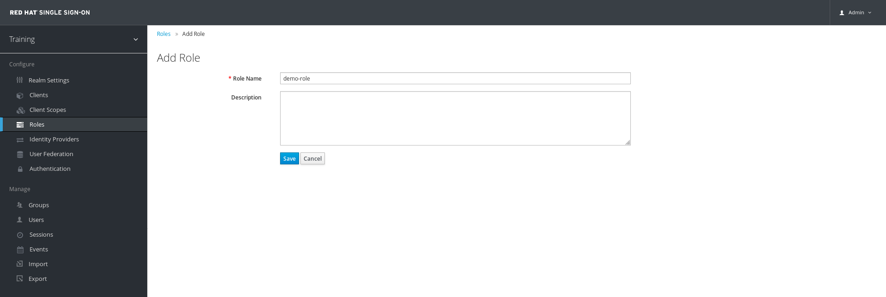

Once saved, the new Role can be customized with **Attributes** (key/value pairs)
and **Users in Role**, users to be associated to the new role.

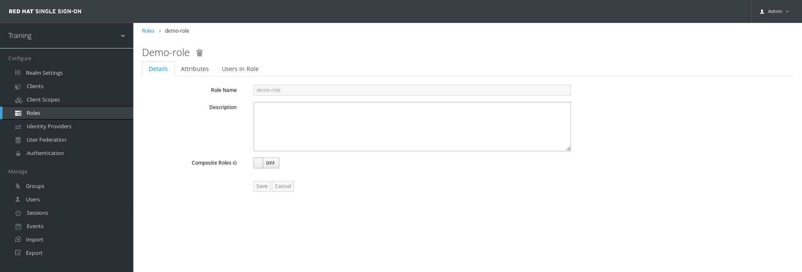

#### Adding Client Roles
Client Roles are more fine grained and related only to a specific client. To
add a client role go to `Clients` -> *Client name* -> `Roles` and click the
`Add Role` button.

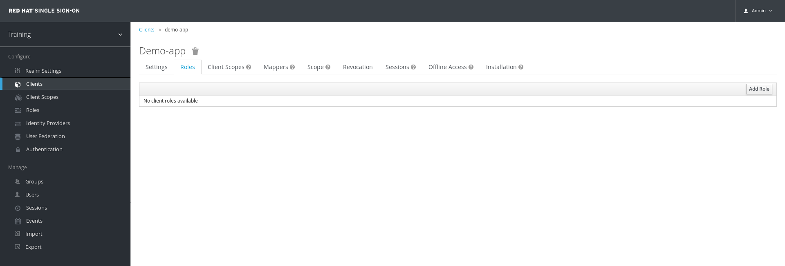

Define the mandatory **Role Name** field to continue:


After creation the edit panel will be shown. Notice that there is no **Users in Role** tab here, since the role is only related to a specific client.

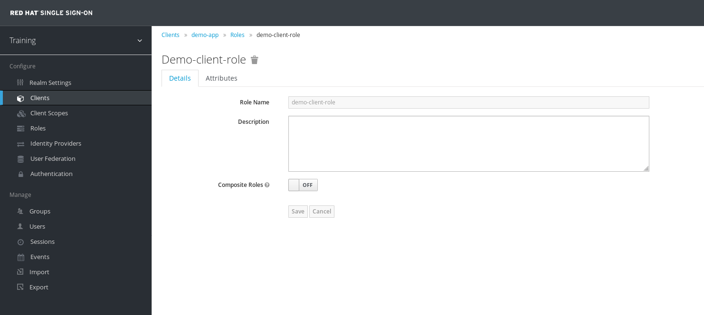

#### Role Scope Mappings
RH-SSO lets administrators define, for every client, the role scope mappings.
By default when an OIDC access token is issued it contains all the scope mapppings
of the user (**Full Scope**).
Administrators can filter the mappings for a client and limit its privileges to
a subset of roles.

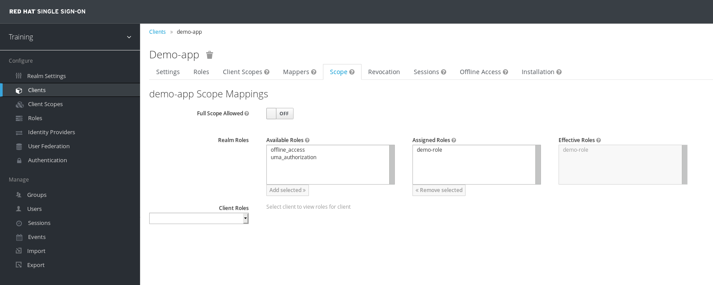

#### Mapping Users to Roles
Realm administrator can map users to specific roles. To do this go to
`Users` -> *user ID* -> `Role Mappings` and select the **Realm Roles** to map
from the **Available Roles** list. New mapped roles will appear in the **Assigned
Roles** list and in the **Effective Roles** non-editable list.

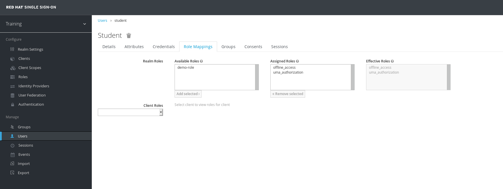

To map **Client Roles** select the desired client from the drop-down menu and
add the role from the **Available Roles** list:

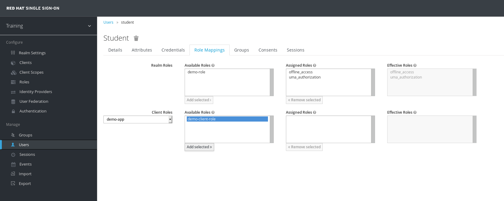
