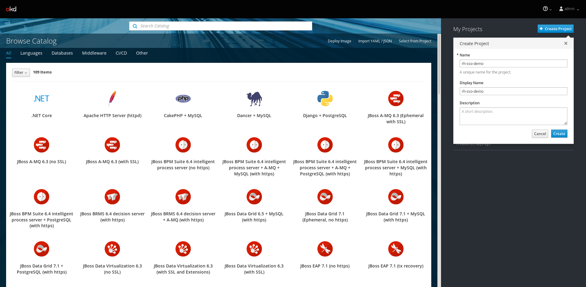
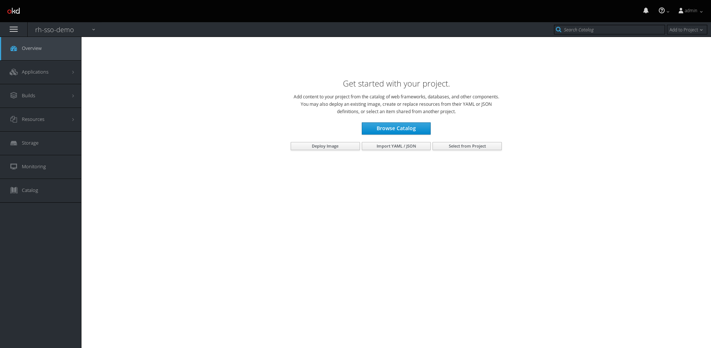
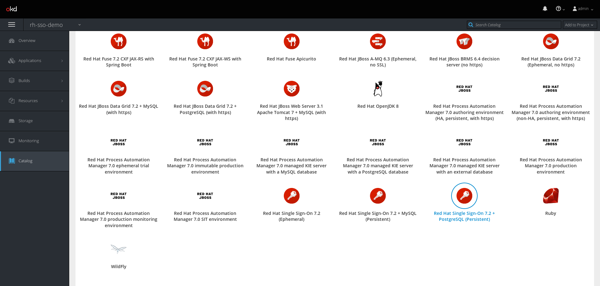
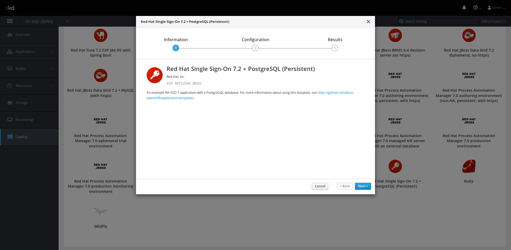
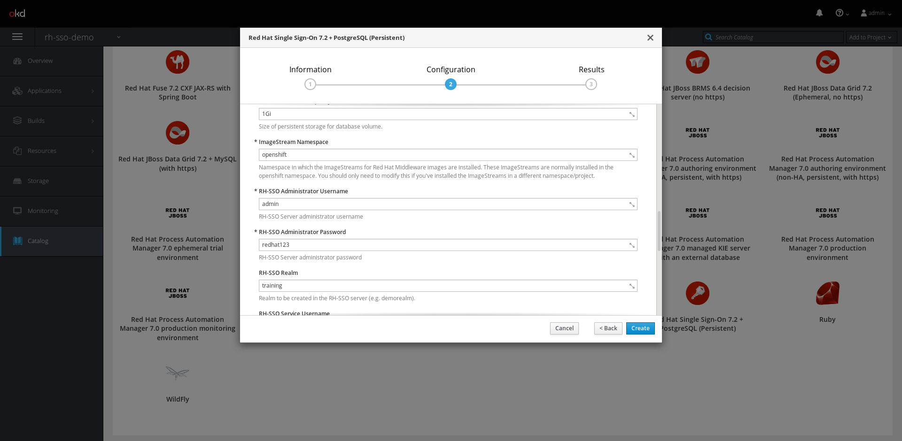
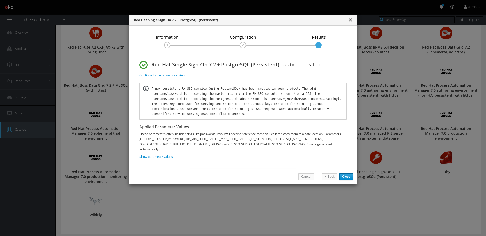
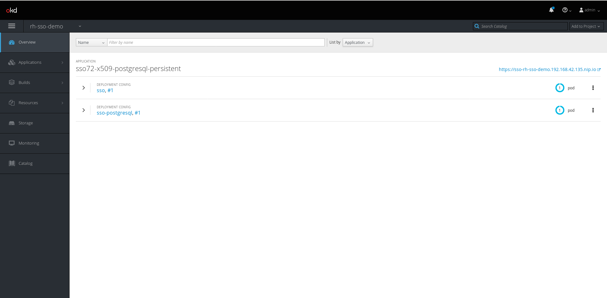
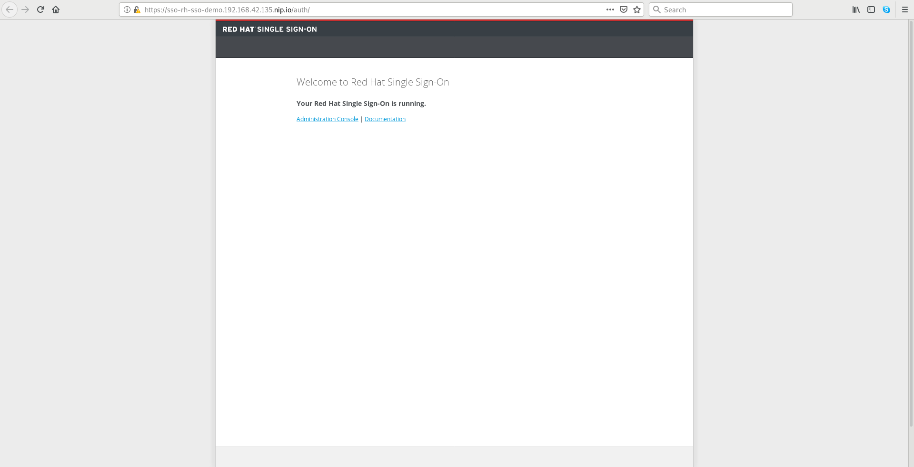
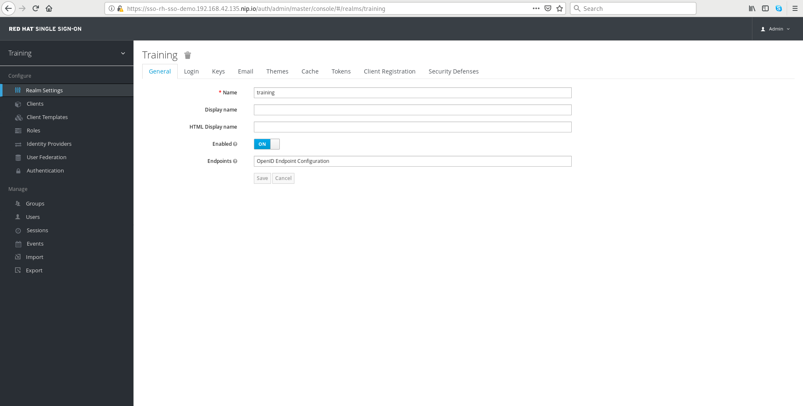

# Deploying Red Hat SSO on OpenShift

This sections shows a deployment example of Red Hat Single Sign-On on
OpenShift Container Platform using the provided **xPaaS** templates and
ImageStreams.

The purpose of this document is to provide a basic Proof of Concept on how to
deploy Red Hat Single Sign-On with PostgreSQL persistence in OpenShift Container
Platform or OKD.

The example below are created using **minishift** in order to help any user to
reproduce the scenario in they own laptops/workstations.

The documents assumes minishift has been already installed on the host. If not,
follow this [guide](https://docs.okd.io/latest/minishift/getting-started/installing.html)
to install.

### Enable Minishift Add-ons
To complete this lab, some add-ons must be enabled in the minishift configurations:
- **admin-user**: this add-on enables the admin user in the openshift cluster.
  Keep in mind that minishift deploys an all-in-one vm with the
  `AllowAllPasswordIdentityProvider` provider, thus enabling logins with **admin**
  user and any password. The default non-admin user is the **developer** user.

- **redhat-registry-login**: this add-on enables the authentication to the
  `registry.redhat.io` registry with the provided credentials. This is mandatory
  since the ImageStreams of the xPaaS applications need to access this official
  registry.

- **xpaas**: this add-on enables all the Templates and ImageStreams for xPaaS
  applications, the offical Red Hat containerized middleware portfolio. **Red
  Hat Single Sign-On** templates will be available after enabling the add-on.

To enable add-ons:

```
$ minishift addons enable admin-user
$ minishift addons enable redhat-registry-login
$ minishift addons enable xpaas
```

After enabling them, apply the addons to the current configuration.

Enable the admin user:
```
$ minishift addons apply admin-user
```

Enable the registry login. Credentials must be provided here in the form of
environment variables with the `-a` flag:
```
$ minishift addons apply redhat-registry-login \
  -a REGISTRY_USERNAME=demouser -a REGISTRY_PASSWORD=demopassword
```

Enable the xPaaS add-on. The registry login must be correctly configured before
applying this last add-on:
```
$ minishift addons apply xpaas
```

### Start Minishift
Start minishift with a minimum of 2 vCPUs and 4096 GiB of RAM with the following
command:

```
$ minishift start --cpus 2 --memory 4096
```

This command will take a while to start the environment, especially in a fresh
installation where the VM image must be downloaded before.

At the end of the bootstrap process, which is logged on standard output, the
following message should appear (the IP address should obviuosly change):

```
Server Information ...
OpenShift server started.

The server is accessible via web console at:
    https://192.168.42.135:8443/console
```

The OpenShift cluster is up and running and ready to be used.

Login to the OpenShift console at the provided url with the **admin** user.


### Deploy RH-SSO
In the main Catalog view, click the `+ Create Project` button to create a new
project where the RH-SSO service will be deployed. Choose a name for the new
project:



Click on the newly created project to go to the main project console. Here,
click to the `Broswse Catalog` button to view all the available applications and
runtimes.



In the Catalog, select **Red Hat Single Sign-On 7.2 + PostgreSQL (Persistent)**
template object, this will start a wizard that collects the OpenShift Template
parameters:



Complete the wizard with the desired paramaeter values:



On the **Configuration** section of the wizard customize the desired values.   
For the sake of simplicity in this demonstration, modify the parameter
**RH-SSO Administrator Username** with the value **admin** and the
**RH-SSO Administrator Password** with the value **redhat123**.  
A new SSO realm can be defined right here in this preliminary stage with the
**RH-SSO Realm** parameter.

**Hint**: all the values with a `*` are mandatory.



The third stage of the wizard will print the outputs of the template processing
and creation. These outputs will contain the RH-SSO credentials and the database
credentials, which have been generated by the template. Click on the `Close` button after copying the ouput.



Back on the project overview page, two running pods will be deployed and will
appear in a short time. In this time (which depends on the connection speed) the
images will be downloaded and started.

At the end of the bootstrap process an **sso** pod and an **sso-postgresql** pod
should appear. The number after the `#` symbol is the deployment counter.   
The circles on the right side represent the counters of instances for every
deployment. By default we have one sso pod and one sso-postgresql pod.



To test the application and access the RH-SSO console a **route** has been
published as a link appearing in the upper right side of the screen. In the
above example the route is *https://sso-rh-sso-demo.192.168.42.135.nip.io*.

### Verifying the deployment
Click on the route link to access the RH-SSO console. Since we didnt' provide
custom certificates for this demonstration the default self-signed certificates
have been generated. Accept the exception from the browser and go ahead.

The welcome page of the **/auth** context will be displayed:



Click on the `Administration Console` link to go to the admin console login page.
Use the credentials defined during deployment (admin/redhat123) to login:


After login the RH-SSO console will be displayed. If a realm has been defined
during deployment, its configuration will be shown, otherwise the master realm
configuration will appear.



Besides the web console, all the RH-SSO APIs will be exposed on the generated
route.

### Using the Openshift CLI
After the application has been deployed the OpenShift CLI `oc` can be used for
maintenace or troubleshooting purposes when the openshift web console is not
available.

To view the running pods in the RH-SSO project:

```
$ oc project rh-sso-demo
Now using project "rh-sso-demo" on server "https://192.168.42.135:8443".
$ oc get pods -o wide
NAME                     READY     STATUS    RESTARTS   AGE
sso-1-5r7q9              1/1       Running   0          33m
sso-postgresql-1-9kkbh   1/1       Running   0          33m
```

The CLI has many useful features. For example, a dedicated command to view
the pods logs. The `oc logs <POD_NAME>` command can show the logs produced
by the pod, while the `-f` oil on the standard output:

```
$ oc logs sso-1-5r7q9 -f
...
15:36:00,691 INFO  [org.keycloak.exportimport.util.ImportUtils] (ServerService Thread Pool -- 62) Realm 'training' imported
15:36:00,740 INFO  [org.keycloak.services] (ServerService Thread Pool -- 62) KC-SERVICES0032: Import finished successfully
15:36:00,740 INFO  [org.keycloak.services] (ServerService Thread Pool -- 62) KC-SERVICES0006: Importing users from '/opt/eap/standalone/configuration/keycloak-add-user.json'
15:36:00,900 INFO  [org.keycloak.services] (ServerService Thread Pool -- 62) KC-SERVICES0009: Added user 'admin' to realm 'master'
15:36:01,038 INFO  [org.jboss.resteasy.resteasy_jaxrs.i18n] (ServerService Thread Pool -- 62) RESTEASY002225: Deploying javax.ws.rs.core.Application: class org.keycloak.services.resources.KeycloakApplication
15:36:01,039 INFO  [org.jboss.resteasy.resteasy_jaxrs.i18n] (ServerService Thread Pool -- 62) RESTEASY002205: Adding provider class org.keycloak.services.filters.KeycloakTransactionCommitter from Application class org.keycloak.services.resources.KeycloakApplication
15:36:01,039 INFO  [org.jboss.resteasy.resteasy_jaxrs.i18n] (ServerService Thread Pool -- 62) RESTEASY002200: Adding class resource org.keycloak.services.resources.JsResource from Application class org.keycloak.services.resources.KeycloakApplication
15:36:01,039 INFO  [org.jboss.resteasy.resteasy_jaxrs.i18n] (ServerService Thread Pool -- 62) RESTEASY002205: Adding provider class org.keycloak.services.error.KeycloakErrorHandler from Application class org.keycloak.services.resources.KeycloakApplication
15:36:01,040 INFO  [org.jboss.resteasy.resteasy_jaxrs.i18n] (ServerService Thread Pool -- 62) RESTEASY002200: Adding class resource org.keycloak.services.resources.ThemeResource from Application class org.keycloak.services.resources.KeycloakApplication
15:36:01,040 INFO  [org.jboss.resteasy.resteasy_jaxrs.i18n] (ServerService Thread Pool -- 62) RESTEASY002220: Adding singleton resource org.keycloak.services.resources.RealmsResource from Application class org.keycloak.services.resources.KeycloakApplication
15:36:01,040 INFO  [org.jboss.resteasy.resteasy_jaxrs.i18n] (ServerService Thread Pool -- 62) RESTEASY002220: Adding singleton resource org.keycloak.services.resources.admin.AdminRoot from Application class org.keycloak.services.resources.KeycloakApplication
15:36:01,040 INFO  [org.jboss.resteasy.resteasy_jaxrs.i18n] (ServerService Thread Pool -- 62) RESTEASY002210: Adding provider singleton org.keycloak.services.util.ObjectMapperResolver from Application class org.keycloak.services.resources.KeycloakApplication
15:36:01,040 INFO  [org.jboss.resteasy.resteasy_jaxrs.i18n] (ServerService Thread Pool -- 62) RESTEASY002220: Adding singleton resource org.keycloak.services.resources.ServerVersionResource from Application class org.keycloak.services.resources.KeycloakApplication
15:36:01,040 INFO  [org.jboss.resteasy.resteasy_jaxrs.i18n] (ServerService Thread Pool -- 62) RESTEASY002220: Adding singleton resource org.keycloak.services.resources.RobotsResource from Application class org.keycloak.services.resources.KeycloakApplication
15:36:01,040 INFO  [org.jboss.resteasy.resteasy_jaxrs.i18n] (ServerService Thread Pool -- 62) RESTEASY002220: Adding singleton resource org.keycloak.services.resources.WelcomeResource from Application class org.keycloak.services.resources.KeycloakApplication
15:36:01,107 INFO  [org.wildfly.extension.undertow] (ServerService Thread Pool -- 62) WFLYUT0021: Registered web context: '/auth' for server 'default-server'
15:36:01,160 INFO  [org.jboss.as.server] (ServerService Thread Pool -- 51) WFLYSRV0010: Deployed "keycloak-server.war" (runtime-name : "keycloak-server.war")
15:36:01,226 INFO  [org.jboss.as.server] (Controller Boot Thread) WFLYSRV0212: Resuming server
15:36:01,232 INFO  [org.jboss.as] (Controller Boot Thread) WFLYSRV0060: Http management interface listening on http://127.0.0.1:9990/management
15:36:01,233 INFO  [org.jboss.as] (Controller Boot Thread) WFLYSRV0054: Admin console is not enabled
15:36:01,233 INFO  [org.jboss.as] (Controller Boot Thread) WFLYSRV0025: Red Hat Single Sign-On 7.2.4.GA (WildFly Core 3.0.17.Final-redhat-1) started in 23903ms - Started 662 of 1061 services (759 services are lazy, passive or on-demand)
```

### Pods scaling
Scaling in/out the pods from command line is an easy task. For example, to scale
the number of RH-SSO instances to two:

```
oc scale dc/sso --replicas=2
deploymentconfig.apps.openshift.io/sso scaled
```

There is a good news about the RH-SSO image in OpenShift: pods are already
configured for clustering using custom JGroups protocal stacks embedding a
dedicated `openshift.DNS_PING` protocol. When pod replicas is incremented the
new pods are clustered together seamlessly.

### Final considerations
Once deployed in an OpenShift cluster, Red Hat Single Sign-On can be used to 
secure all the other applications deployed. It can also be configured as an
OpenShift **Identity Provider** for the cluster authentication.

The usage of a persistent database (PostgreSQL in this example) guarantees the
binding to a **persistent volume**, providing data persitence across multiple
restarts of the database pod. If special policies forbids the usage of a
containerized database, the RH-SSO deployment can be customized to point to an
external database.
